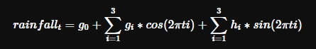

<!-- README.md is generated from README.Rmd. Please edit that file -->

# umbrella 

<!-- badges: start -->

[](https://github.com/mrc-ide/umbrella/actions)
[](https://codecov.io/gh/mrc-ide/umbrella)
[](https://www.repostatus.org/#wip)
<!-- badges: end -->

Umbrella facilitates access and extraction of CHIRPS rainfall data and
fitting of seasonal profiles.

The package leans heavily on data and functionality from:

CHIRPS: Please see the [CHIRPS
website](https://www.chc.ucsb.edu/data/chirps) for more information,
usage rights and [citation
infromation](http://legacy.chg.ucsb.edu/data/chirps/#_Citations).

Google Earth Engine: Please see (and sign up for) [Google Earth
Engine](https://earthengine.google.com/)

rgee: A superb R package for acessing and processing data from Google
Earth Engine. Please see [rgee](https://r-spatial.github.io/rgee/) for
more info.

## Installation

Please install from [GitHub](https://github.com/) with:

``` r
# install.packages("devtools")
devtools::install_github("mrc-ide/umbrella")
```

You will also need to sign up to [Google Earth
Engine](https://earthengine.google.com/) and follow the [set up
instructions for rgee](https://r-spatial.github.io/rgee/#installation)
before using `umbrella`.

We estimate the fourier series representing general seasonal profiles
given rainfall in a setting using the following equation



where


are fitted parameters. This equation can be fitted as a linear model
using Rs `lm` function.

However, we impose an additional constraint when fitting: the rainfall
floor. This sets a minimum lower bound on the value of rainfall. With
this constraint we fit the resulting model with the `nlm()` function.
